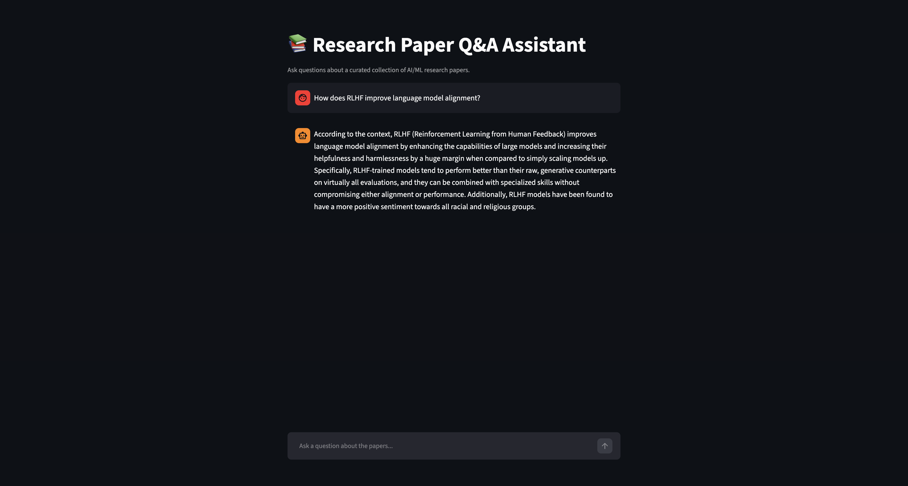

# Research Paper Q&A Assistant

I built this project to make it easier to explore and query a collection of AI/ML research papers through natural language. Instead of ctrl+F-ing through PDFs, you can just ask questions and get grounded answers pulled directly from the papers.

## What it does

You ask a question, the system finds the most relevant passages across 18 research papers, and passes them to an LLM to generate an answer. It only answers based on what's actually in the papers — if the answer isn't there, it says so.

## Demo



## How it works

1. **Ingest** — PDFs are parsed with PyMuPDF, split into 500-character chunks, and embedded using `all-MiniLM-L6-v2` from sentence-transformers
2. **Retrieve** — at query time, FAISS finds the 4 most semantically similar chunks to the question
3. **Generate** — the retrieved chunks are passed as context to Llama 3 via Groq, which produces a grounded answer

## Stack

Python · LangChain · FAISS · Sentence Transformers · Groq (Llama 3) · Streamlit · PyMuPDF

## Papers indexed

18 foundational AI/ML papers covering transformers, large language models, RLHF, retrieval-augmented generation, and core deep learning — including Attention Is All You Need, BERT, GPT-3, LLaMA 2, InstructGPT, and the original RAG paper.

## Run locally

1. Clone the repo and install dependencies:

```
pip install -r requirements.txt
```

2. Add your Groq API key to a `.env` file:

```
GROQ_API_KEY=your_key_here
```

3. Add PDFs to a `papers/` folder and index them:

```
python ingest.py
```

4. Launch the app:

```
streamlit run app.py
```

## Example questions

- "What is the main idea behind attention mechanisms?"
- "How does RLHF improve language model alignment?"
- "What are the limitations of transformer models?"
- "What is the difference between BERT and GPT?"

## What I'd improve next

- Add source citations so answers show which paper each chunk came from
- Support uploading new PDFs directly through the UI
- Experiment with larger embedding models for better retrieval accuracy
- Add a reranking step to improve answer quality
